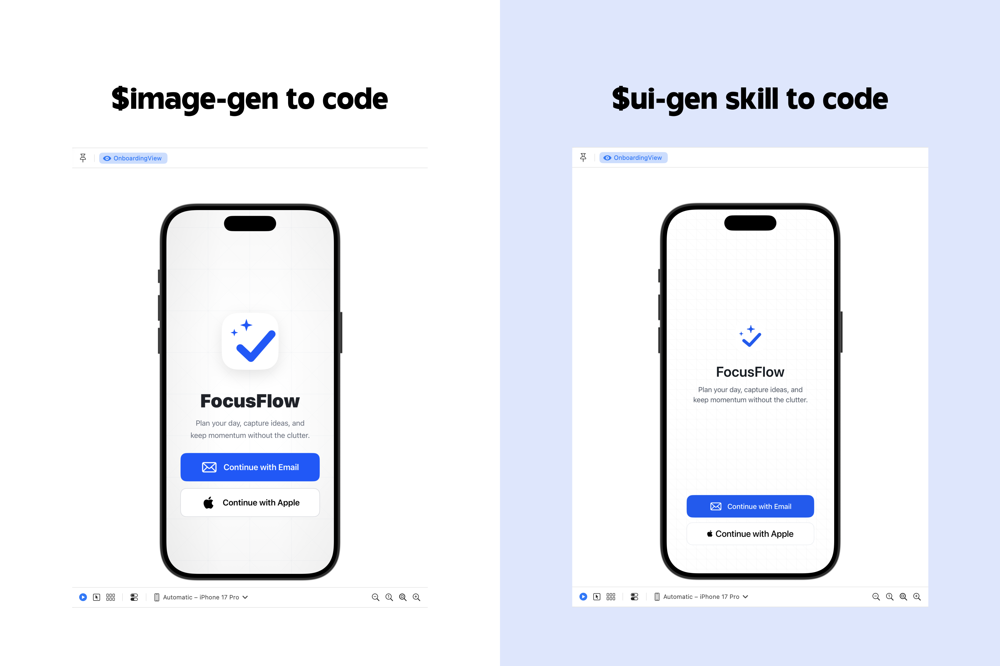

# UI Gen

Codex is better at turning a generated design image into code when it first has a component map for the design. `ui-gen` does that in one step.

It generates a single composite UI annotation image: a polished screen mockup, an implementation map, and connector lines between visible UI elements and the code-shaped notes that describe them.



## What It Makes

- A design/layout screen on the left
- A component map on the right
- Thin callout lines between UI elements and annotations
- Stack-aware labels for SwiftUI, React, Jetpack Compose, Flutter, or generic UI structure
- Notes for layout, spacing, sizing, padding, alignment, and responsive constraints

## Use It

Start from a text prompt:

```text
$ui-gen design a welcome screen for a productivity app on iOS
```

Or use an existing image or screenshot of your design:

```text
Use $ui-gen to generate a composite UI annotation image for this screen.
```

Then use the generated annotation image as the source when asking Codex to build the UI.
